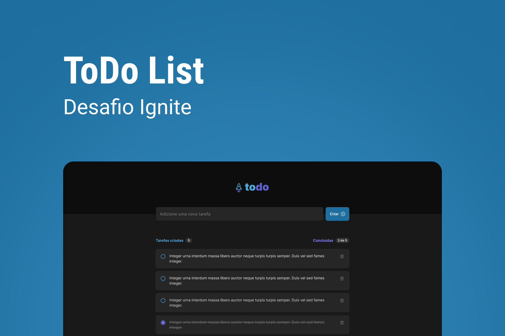

<h1 align="center">ToDo List</h1>

 

  

## 💡 Sobre o projeto

O objetivo desse projeto é praticar alguns dos conceitos mais importantes da biblioteca ReactJS.
A aplicação consiste em uma lista de tarefas, na qual o usuário pode adicionar, remover e marcar suas tarefas como concluídas.

🔗 [Clique aqui](https://todo-list-ignitee.vercel.app/) para acessar o projeto.

## 🚀 Tecnologias utilizadas

- [ReactJS](https://pt-br.reactjs.org/)
- [TypeScript](https://www.typescriptlang.org/)
- [VITE](https://vitejs.dev/)
- [Phosphor Icons](https://phosphoricons.com/)

## 🖼️ Layout

O layout utilizado como base para a realização do projeto encontra-se [nesse link](<https://www.figma.com/file/98iBSoDaMN4NEPkx9QqpA0/ToDo-List-(Copy)?node-id=56%3A99&t=Lo78aP0UB7VDtXRq-0>).

É necessário ter uma conta no [Figma](https://figma.com) para ter acesso.
